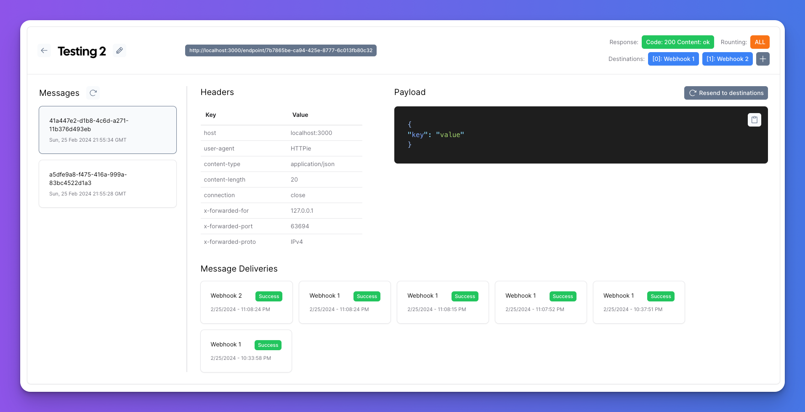

This is a [Next.js](https://nextjs.org/) project bootstrapped with [`create-next-app`](https://github.com/vercel/next.js/tree/canary/packages/create-next-app).

## Getting Started

First, run the development server:

---



## About

A simple tool for working with webhooks.
Great for teams and staging environments.

Watch the introduction video [on youtube](https://youtu.be/q3dS1leG1wQ)

Capabilities

- add multiple endpoints
- save received messages (for 7 days)
- automatically forward incoming messages to one or more destinations
- choose forwarding strategy (send to: first in list, all in list)
- support fallback forwarding (if first is down, forward to next)
- replay webhook delivery (resend the data to destinations)

_Want to send messages to your local machine and need a tunnel?
Check out [untun](https://github.com/unjs/untun) by the UnJs team_

---

## Tech Stack

`UnWebhook` is built with the following epic technologies & tools:

- [Next JS](https://nextjs.com) React based FrontEnd & Backend
- [Tailwind](https://tailwindcss.com/) CSS Engine
- [tRPC](https://trpc.io/) Typesafe APIs
- [DrizzleORM](https://orm.drizzle.team/) ORM + MySQL

## Running Locally

To get a local copy up and running, follow these simple steps.

### Prerequisites

Here is what you need to be able to run UnInbox locally.

- A Supabase database
- Node.js (Version: >=20.x)
- NVM (Node Version Manager) (see https://github.com/nvm-sh/nvm)
- pnpm (see https://pnpm.io/installation)

### Setup

1. Clone the repo into a public GitHub repository (or fork https://github.com/un/webhook-proxy/fork).

   ```sh
   git clone https://github.com/un/webhook-proxy.git UnWebhook
   ```

   > If you are on Windows, run the following command on `gitbash` with admin privileges: <br> > `git clone -c core.symlinks=true https://github.com/un/webhook-proxy.git` <br>
   > See [docs](https://cal.com/docs/how-to-guides/how-to-troubleshoot-symbolic-link-issues-on-windows#enable-symbolic-links) for more details.

2. Go to the project folder

   ```sh
   cd UnWebhook
   ```

3. Check and install the correct node/pnpm versions

   ```sh
   nvm install
   ```

4. Install packages with pnpm

   ```sh
   pnpm i
   ```

5. Set up your `.env` file

   - Duplicate `.env.example` to `.env`. This file is already pre-configured for use with the local docker containers

     mac

     ```sh
      cp .env.example .env
     ```

     windows

     ```sh
      copy .env.example .env
     ```

6. Set your env variables

Open [http://localhost:3000](http://localhost:3000) with your browser to see the result.

You can start editing the page by modifying `app/page.tsx`. The page auto-updates as you edit the file.

This project uses [`next/font`](https://nextjs.org/docs/basic-features/font-optimization) to automatically optimize and load Inter, a custom Google Font.

## Learn More

To learn more about Next.js, take a look at the following resources:

- [Next.js Documentation](https://nextjs.org/docs) - learn about Next.js features and API.
- [Learn Next.js](https://nextjs.org/learn) - an interactive Next.js tutorial.

You can check out [the Next.js GitHub repository](https://github.com/vercel/next.js/) - your feedback and contributions are welcome!

## Deploy on Vercel

The easiest way to deploy your Next.js app is to use the [Vercel Platform](https://vercel.com/new?utm_medium=default-template&filter=next.js&utm_source=create-next-app&utm_campaign=create-next-app-readme) from the creators of Next.js.

Check out our [Next.js deployment documentation](https://nextjs.org/docs/deployment) for more details.
